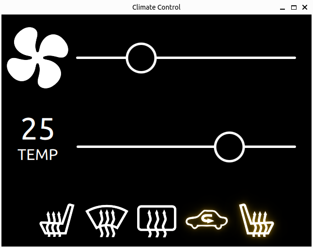

# climate-control
A Dummy car climate control GUI demo with QML and some inline JavaScript.\
The temperature slider controls the temperature value.\
Clicking the icons toggles the indication glow.

## Versions
cmake version 3.22.1\
Qt verison 6.8.1

## TODO
- Fix QML Image mirror issue.
- Fix slider mouse area.
- Refactoring and linting
